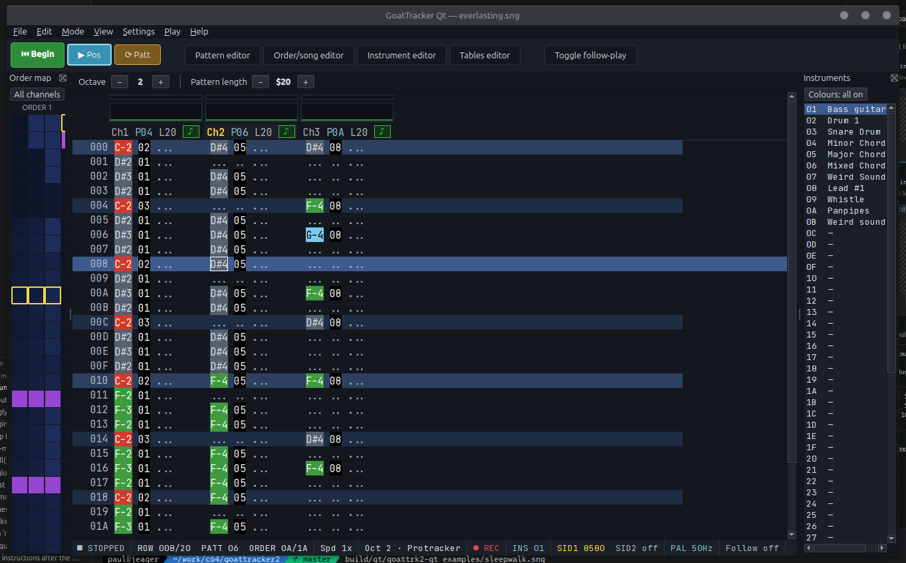
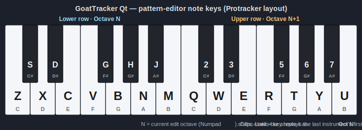

# GoatTracker 2 — Qt edition



Modern Qt6 frontend for [GoatTracker 2](http://covertbitops.c64.org/) by
Lasse Öörni, the Commodore 64 SID chip tracker.

This fork keeps full `.sng` and `.ins` file compatibility with the
original SDL build (v2.77) while replacing the renderer and audio backend
with native Qt6 widgets and a PortAudio backend. Extends the engine with:

- libresidfp 2.x SID emulator (replaces bundled reSID + reSID-fp)
- runtime mono ↔ dual-SID / 6-channel toggle, hybrid 6581 + 8580 setups
- microtonal tuning (12 / 19 / 24-TET, custom N-TET, Scala `.scl` files)
- Janko isomorphic key layout alongside Protracker / DMC
- undo / redo, instrument-archetype presets, table-step templates
- Merge song (Ctrl+M), `gt2reloc` standalone packer / relocator
- JSON-RPC over stdin/stdout for headless testing + agent automation

## Building

Requires Qt 6, SDL 1.2 (or sdl12-compat), JACK, PortAudio, CMake and a
C++17 compiler.

### Linux (Debian / Ubuntu)

```sh
sudo apt install qt6-base-dev libsdl1.2-dev libjack-jackd2-dev \
                 portaudio19-dev cmake g++ ninja-build
cmake -S . -B build
cmake --build build -j
```

### macOS (Homebrew)

```sh
brew install qt sdl12-compat jack portaudio cmake ninja pkg-config
cmake -S . -B build \
  -DCMAKE_PREFIX_PATH="$(brew --prefix qt);$(brew --prefix)" \
  -DCMAKE_C_FLAGS="-I$(brew --prefix)/include" \
  -DCMAKE_CXX_FLAGS="-I$(brew --prefix)/include"
cmake --build build -j
```

### Windows (MSYS2 / MinGW64)

From a MINGW64 shell:

```sh
pacman -S --needed mingw-w64-x86_64-gcc mingw-w64-x86_64-cmake \
  mingw-w64-x86_64-ninja mingw-w64-x86_64-pkgconf \
  mingw-w64-x86_64-qt6-base mingw-w64-x86_64-qt6-tools \
  mingw-w64-x86_64-SDL mingw-w64-x86_64-jack2 mingw-w64-x86_64-portaudio
cmake -S . -B build -G Ninja -DCMAKE_BUILD_TYPE=Release
cmake --build build -j
```

Three binaries land in `build/qt/`:

| binary        | purpose                                          |
| ------------- | ------------------------------------------------ |
| `goattrk2-qt` | the editor — main app                            |
| `gt2reloc`    | CLI packer / relocator (PRG / SID / BIN export)  |
| `sid2sng`     | CLI converter: `.sid` → `.sng` (opening `.sid`)  |

## Running

```sh
./build/qt/goattrk2-qt
./build/qt/goattrk2-qt examples/dojo.sng
```

CLI options follow the historic GoatTracker layout; see `goat_tracker_commands.pdf`
or run `--help`.

## Importing `.sid` / MIDI / other formats (optional)

The editor opens `.sng` files natively. To import `.sid`, MIDI, or other
formats it shells out to [ChiptuneSAK](https://github.com/c64cryptoboy/ChiptuneSAK),
a Python toolkit that converts those formats to GoatTracker `.sng`.
ChiptuneSAK is **optional** — without it the Open Song dialog only shows
the SNG filter, and everything else in the editor works as usual.

When the editor finds ChiptuneSAK at launch (`python3 -c "import
chiptunesak"` succeeds), the Open Song dialog adds `*.sid` / `*.mid` /
`*.midi` filters and the import goes through `ext/chiptunesak/sid_to_sng.py`.

### Install (with [uv](https://docs.astral.sh/uv/))

We use [`uv`](https://github.com/astral-sh/uv) — a fast, no-dependencies
Python package manager from Astral.

Install `uv` first if you don't have it:

```sh
# Linux / macOS
curl -LsSf https://astral.sh/uv/install.sh | sh
# OR via pipx / Homebrew / cargo:
brew install uv         # macOS
cargo install --git https://github.com/astral-sh/uv uv
```

Then set up ChiptuneSAK next to the editor. Pick any directory for the
clone — examples below use `$HOME/ChiptuneSAK`, swap in whatever you
prefer:

```sh
# 1. Clone ChiptuneSAK (not on PyPI yet)
git clone https://github.com/c64cryptoboy/ChiptuneSAK "$HOME/ChiptuneSAK"

# 2. Create a venv beside the editor and install ChiptuneSAK's deps
uv venv ext/chiptunesak/venv
uv pip install --python ext/chiptunesak/venv/bin/python \
    mido matplotlib numpy more-itertools parameterized

# 3. Tell the editor where ChiptuneSAK lives
export GT2_CHIPTUNESAK_PATH="$HOME/ChiptuneSAK"

# 4. Make python3 resolve to the venv, then launch
PATH="$PWD/ext/chiptunesak/venv/bin:$PATH" ./build/qt/goattrk2-qt
```

`GT2_CHIPTUNESAK_PATH` is the only path the editor cares about. Set it
once in your shell rc to make every launch pick up the importer.

Restart the editor after installing — the SID / MIDI filters appear in
the Open Song dialog.

### Verify

```sh
PATH="$PWD/ext/chiptunesak/venv/bin:$PATH" \
PYTHONPATH="$HOME/ChiptuneSAK" \
python3 -c "import chiptunesak.sid; import chiptunesak.goat_tracker; print('ok')"
```

If that prints `ok`, the editor's `Open Song` dialog will show
`*.sid` / `*.mid` / `*.midi` filters.

> ⚠️ **Watch out:** `~` is **not expanded** inside double quotes, so
> `PYTHONPATH="~/path"` ends up as the literal string `~/path` and the
> import fails. Always use `"$HOME/path"` or an absolute path. Same
> applies to `GT2_CHIPTUNESAK_PATH`.

### Caveats

ChiptuneSAK is in alpha and runs a 6502 emulator over the SID's player
code, then quantises the captured register writes into tracker patterns.
Expect:

- Some SIDs trip an unimplemented 6502 opcode and fail. Roughly 75 % of
  HVSC SIDs we sampled imported successfully on the first try.
- The resulting `.sng` is musically close but not byte-identical to the
  original — it's a best-effort tracker representation, not a re-recording.
- MIDI import respects channels and approximate note timing; ADSR and
  filter envelopes are not reconstructed (the SID didn't carry them).

For headless / scripted use:

```sh
./build/qt/goattrk2-qt --rpc --platform offscreen
```

then pipe JSON one line per command on stdin. The protocol is documented
in `qt/Rpc.cpp`.

## Editor overview

Five editor screens, switched with `F5`/`F6`/`F7`/`F8` or Tab:

- **Pattern editor** — per-channel VU + envelope scope, beat / downbeat
  tints, follow-play center scroll, hex-row numbering, clickable channel
  headers (pattern#, length, mute).
- **Order / song editor** — QTableView, subtune QSpinBox, RST / Repeat /
  Transpose semantic colouring, pattern preview pane.
- **Instrument editor** — instrument list, ADSR + 1stFrame Wave +
  wavetable / pulse / filter / vibrato pointers, live ADSR envelope
  graph, wavetable program preview strip, 14 starter presets
  (Bass / Lead / Pluck / Pad / Brass / Organ / Bell / Strings / Drum kit).
- **Tables editor** — Wave / Pulse / Filter / Speed in tabs, "What it
  does" decoder column, per-table HTML legend, "+ Add step…" template
  menu, pointer-to-row indicator.
- **Song name** — title / author / copyright fields.

Side docks:

- **Order map** — vertical strip showing all orderlist entries with the
  red playback marker. Click = move all-channel cursor + jump the
  pattern editor; **Ctrl+click** = single-channel move.
- **Instruments** — full list of the 63 instruments, click to switch.

Status strip at the bottom shows: transport state, row / pattern /
order position, speed multiplier, octave, current instrument, SID chip
model (clickable to toggle 6581 ↔ 8580), PAL/NTSC (clickable),
follow-play state.

## Note-entry keyboard

The pattern editor maps the host keyboard onto two chromatic octaves
(Protracker layout, used by the original GoatTracker SDL build). The
lower keyboard row (`Z`..`M` plus black-key sharps on `S` `D` `G` `H`
`J`) plays the current edit octave; the upper row (`Q`..`U` plus sharps
on `2` `3` `5` `6` `7`) plays the octave above. Numpad `+` / `−` shifts
the base octave; the status strip shows it as `Oct N`.



Alternate layouts (DMC and Janko) live under **Settings → Note entry
layout**.

## Key data formats

`.sng` file layout (see also `docs/quickstart.md`):

```
GTS5             4 bytes magic
songname[32]     UTF-8-ish, NUL-padded
authorname[32]
copyrightname[32]
nsubtunes        u8
  for each subtune:
    for each channel (3 mono / 6 stereo):
      n               u8   orderlist length
      orderlist[n+2]      includes RST endmark + restart pos
ninstr           u8
  for each instr:
    AD u8, SR u8, WTBL u8, PTBL u8, FTBL u8, STBL u8,
    vibdelay u8, gatetimer u8, firstwave u8, name[16]
for each of 4 tables (wave / pulse / filter / speed):
    n        u8
    left[n]
    right[n]
npatterns        u8
  for each pattern:
    nrows u8
    rows[nrows*4]   (note, instr, cmd, param)
```

Pattern note bytes:

```
$60..$BC   notes C-0 .. G#7
$BD        REST
$BE        Key-off
$BF        Key-on
$FF        end of pattern
```

Command digit semantics:

```
0XY  do nothing
1XY  portamento up (speedtable idx)
2XY  portamento down
3XY  toneportamento
4XY  vibrato
5XY  set AD
6XY  set SR
7XY  set wave
8XY  set wavetable pointer
9XY  set pulsetable pointer
AXY  set filtertable pointer
BXY  set filter control + ch bitmask
CXY  set cutoff
DXY  set master volume / timing mark
EXY  funktempo
FXY  set tempo
```

## SID compositional reference

Wavetable left byte:

```
$00      no change
$01-$0F  delay 1..15 frames
$10-$DF  waveform value (gate $01, ringmod $04, sync $02, test $08,
                         tri $10, saw $20, pulse $40, noise $80)
$E0-$EF  inaudible waveform $00-$0F
$F0-$FE  execute pattern command 0XY..EXY (R = param)
$FF      jump (R = target step, $00 = stop)
```

Wavetable right byte:

```
$00-$5F  relative note +0..+95 semitones
$60-$7F  negative relative -1..-32
$80      hold frequency unchanged
$81-$DF  absolute notes C#0..B-7
```

Pulse table:

```
$01-$7F  modulate L ticks at signed-byte speed R
$8X-$FX  set pulse width X|R (12-bit value $000-$FFF)
$FF      jump (R = target, $00 = stop)
```

Filter table:

```
$00      set cutoff (R = value)
$01-$7F  modulate L ticks at signed-byte speed R
$8X      set passband + bitmask
            $80 off, $90 lowpass, $A0 bandpass, $B0 low+band,
            $C0 highpass, $D0 low+high, $E0 high+band, $F0 all-pass
          R = (resonance hi-nyb) | (channel mask lo-nyb)
$FF      jump
```

Speed table (shared by 1XY/2XY/3XY/4XY/EXY):

```
Vibrato:    L = ticks-before-direction-flip, R = pitch delta / tick
Portamento: signed 16-bit LR added to pitch each tick
Funktempo:  L = even-row tempo, R = odd-row tempo
L bit $80   enables note-independent calc; R = right-shift divisor
```

## Composition workflow

The five docs under `docs/` cover the SID author's path in detail:

- `docs/quickstart.md` — "if you know ProTracker, here's the diff"
- `docs/sid-composition.md` — 11 instrument archetypes with full
  hex recipes, wavetable arpeggio cookbook, PWM / filter idioms,
  6581 vs 8580 cheat sheet, multi-channel arrangement patterns
- `docs/sid-register-tricks.md` — register-level idioms (combined
  waveforms, hard-restart patterns, ring/sync wiring, ADSR-bug
  workarounds), 10 UI affordance proposals
- `docs/tracker-ux-patterns.md` — survey of Renoise / OpenMPT /
  MilkyTracker / FamiStudio / Furnace / DefleMask UX patterns
- `docs/embedding-guide.md` — packing for use in a homebrew C64
  game (IRQ choice, ZP map, `$01 = $35`, SFX engine quirks,
  `gt2reloc` flag cheat sheet)
- `docs/codebase64-mining.md` — codebase64 SID-programming pages
  ported to instrument-preset and table-template proposals

## Authors

- Original Editor by Lasse Öörni (loorni@gmail.com)
- HardSID 4U support by Táli Sándor
- Uses libresidfp / reSIDfp (Leandro Nini's modern fork of Dag Lem's
  reSID with Antti Lankila's nonlinear filter improvements)
- Uses 6510 crossassembler from Exomizer2 by Magnus Lind
- Patches over the years from Stefan A. Haubenthal, Valerio Cannone,
  Raine M. Ekman, Groepaz, drfiemost
- GoatTracker icon by Antonio Vera
- Command quick reference by Simon Bennett

Qt6 frontend, libresidfp port, dual-SID runtime toggle, microtonal,
Janko, embedded RPC, mining of SID composition docs by Claude Opus 4.7
in collaboration with the maintainer of this fork.

## License

GNU General Public License v2 or later. See `COPYING`.

Covert BitOps homepage: <http://covertbitops.c64.org>
Original GoatTracker 2 SourceForge: <http://sourceforge.net/projects/goattracker2>
